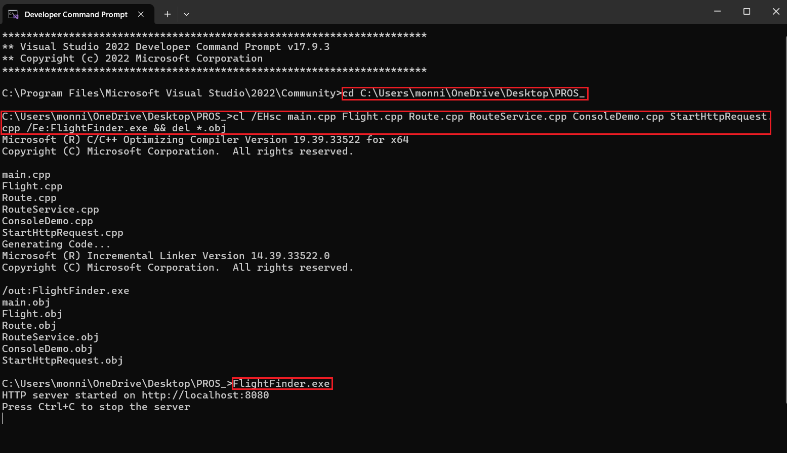
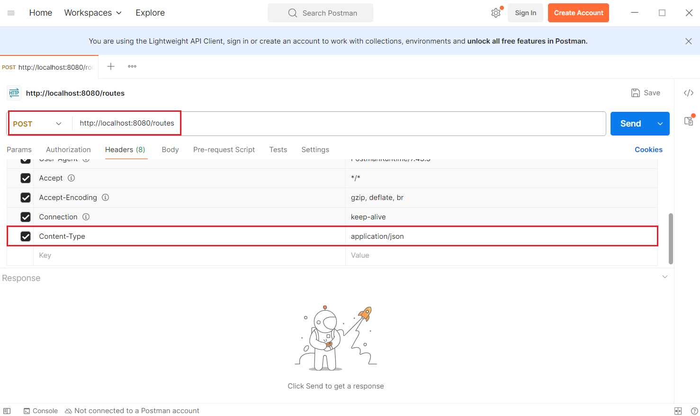
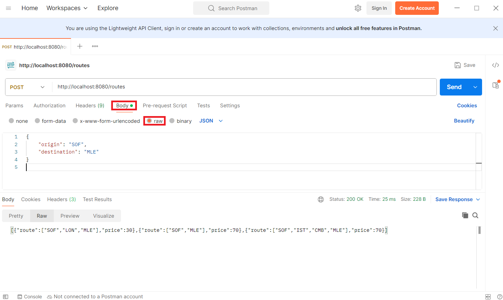
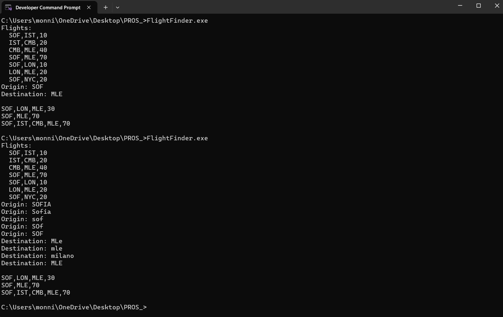

# Compilation Process
Used compiler for this project: `Microsoft (R) C/C++ Optimizing Compiler Version 19.39.33522 for x64`  
Operating system: `Microsoft Windows [Version 10.0.22631.5126]`  
C++ version: `ISO C++14 Standard`

## Prerequisites
&emsp; - C++ compiler with C++14 support (e.g. Microsoft C/C++ Optimizing Compiler, MinGW)  
&emsp; - For the REST API: `cpp-httplib` and `nlohmann/json`  
&emsp; - For the requests execution: e.g. Postman

## Running Process
**`StartHttpRequest`** module (Subtasks 2 and 3) 

&emsp;1. Download and unarchive the repository  
&emsp;2. Extract the **`.h/.hpp, .cpp`** and **`.txt`** files from folders  
&emsp;3. Open Developer Command Prompt for VS and go to the project folder  **`cd <path_to_project_folder>`**. Then compile the project **`cl /EHsc main.cpp Flight.cpp Route.cpp RouteService.cpp ConsoleDemo.cpp StartHttpRequest.cpp /Fe:FlightFinder.exe && del *.obj`**. After the project is compiled start the server **`FlightFinder.exe`**   

&emsp;&emsp;&emsp;4. Open Postman - project endpoint: **`http://localhost:8080/routes`** and select **`POST`** method. Add in Headers **`Content-Type   aplication/json`**  

 
&emsp;&emsp;&emsp;5. Send a request and get a response  

---
**`ConsoleDemo`** module (Subtask 1)  

&emsp;1. Download and unarchive the repository   
&emsp;2. Extract the **`.h/.hpp, .cpp`** and **`.txt`** files from folders  
&emsp;3. Open the project in Visual Studio. In **`main.cpp`** uncomment the **`runConsoleDemo(routeService)`** function and comment **`startHttpServer(routeService)`**.    
&emsp;4. Execute the step 3 from **`StartHttpRequest`** module (Subtasks 2 and 3)  
&emsp;5. Run some examples  

